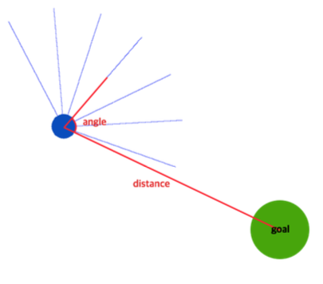

# Reinforcement Learning Robot Simulation using Tensorflow
In this project, the robot(agent) avoids static/dynamic obstacles in the environment.  

The blue robot has no prior knowledge of the environment. It doesn't know where the obstacles are. It uses seven sensors(e.g. ultrasonic/laser) to detect its surroundings, and uses these measured information to make decisions(move forward, turn left/right).  

There are two different goals:  
1. Avoid obstacles in the environment  
2. Navigate towards the goal while avoiding obstacles  

In the neural network folder, there are two sub folders.  
In obstacle avoidance folder, there are files that run the agent under the static/dynamic envrionment. The agent in this environment has one goal which is to avoid obstacles in the environment.   

In the second folder, reach destination, there are files that run the agent under the static/dynamic environment. The agent has two goals. First is to avoid obstacles, and second is to navigate towards the destination(marked green).  

To run the project, follwing requriements should be installed:  
-pygame [installation](http://www.pygame.org/lofi.html)  
-matplotlib [installation](http://matplotlib.org/users/installing.html)  
-numpy [installation](https://docs.scipy.org/doc/numpy/user/install.html)  
-tensorflow [installation]()

##To run the agent in static environment
$ python2.7 static test.py

##To run the agent in dynamic environment 
$ python2.7 dynamic test.py

