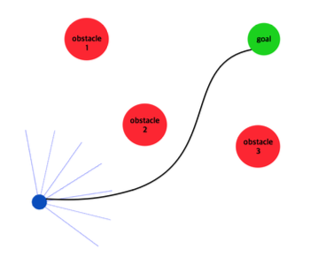

# Reinforcement Learning Robot Simulation using Tensorflow
In this project, the robot(agent) avoids static/dynamic obstacles in the environment.  

The blue robot has no prior knowledge of the environment. It doesn't know where the obstacles are. It uses seven sensors(e.g. ultrasonic/laser) to detect its surroundings, and uses these measured information to make decisions(move forward, turn left/right).  

There are two different goals:  
1. Avoid obstacles in the environment  
2. Navigate towards the goal while avoiding obstacles  

In the neural network folder, there are two sub folders.  
In the obstacle avoidance folder, there are files that run the agent under static/dynamic envrionments. The agent in this environment has one goal which is to avoid obstacles.   

In the second folder, reach destination folder, there are files that run the agent under static/dynamic environments. The agent has two goals. First is to avoid obstacles, and second is to navigate towards the goal(marked green).  

##Notes
-The state of the agent is represented depending on the sensor readings.  
-Q learning is used together with the function approximation.  
-Occupancy grid mapping is used to locate obstacles in the environment.  
(However, this information is not currently used to help the agent make decisions)  
  

##Requirements
To run the project, follwing requriements should be installed:  
-pygame [installation](http://www.pygame.org/lofi.html)  
-matplotlib [installation](http://matplotlib.org/users/installing.html)  
-numpy [installation](https://docs.scipy.org/doc/numpy/user/install.html)  
-tensorflow [installation](https://www.tensorflow.org/install/)

##What to see  
  
1)Current episode  
2)Epsilon value(decides wheter to choose best action or random action)  
3)Seven sensor readings(in range between 0 to 20)  
4)Expected reward of each actions  
5)Distance and relative angle to the goal(used to represent the state of the agent)  
6)Current reward  
7)Buttons to control the environment  
8)Probabiliy that shows if detected obstacle is static  

##To run the agent in static environment
$ python2.7 static test.py  
  

##To run the agent in dynamic environment 
$ python2.7 dynamic test.py  
  

